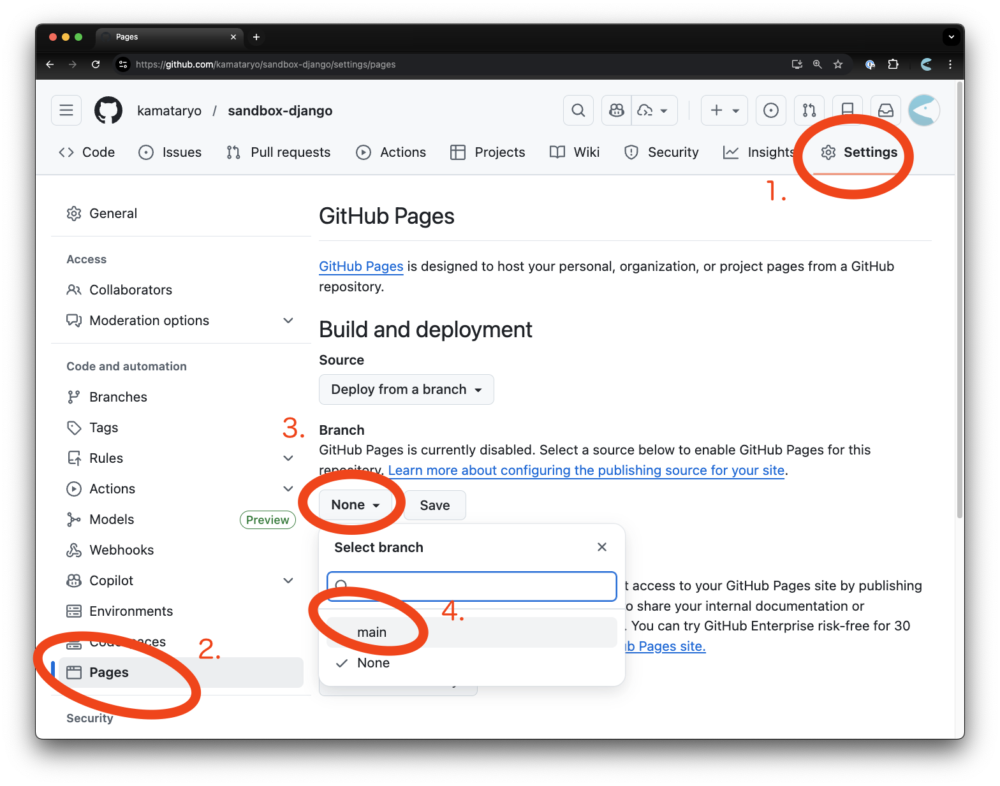

<style>
/* ページ番号は右上。リアクションコンポーネントをおきたいので */
section.title::after { top: 21px; }
</style>

<!-- _class: title -->

# MapLibre GL JS と OpenStreetMap で始める<br />ウェブカートグラフィ入門

## 補足: GitHub Pages を使ったプロジェクトのウェブ公開について

立命館大学 2025年度 秋セメスター 火曜5限

---

## GitHub Pages とは

- GitHub の提供するドメインを使い、Webページをインターネットに公開する機能
- `<ユーザー名>.github.io` というドメインが利用可能
- リポジトリに対して1つ作成可能
- `https://<ユーザー名>.github.io/<リポジトリ名>` というURLでアクセス可能

---

## 注意点

利用前に利用規約を一読してください

[利用規約のリンク](https://docs.github.com/ja/pages/getting-started-with-github-pages/what-is-github-pages#github-pages%E3%81%AE%E5%88%A9%E7%94%A8%E4%B8%8A%E3%81%AE%E5%88%B6%E9%99%90)

- 多くの用途で利用可能だが..
- 違法行為に利用しないこと
- 違法なコンテンツ、公序良俗に反するコンテンツなどは配信しないようにすること
- 著作権を含む知的財産について適切な配慮を行うこと(帰属表示など)

---

## GitHub Pages の有効化

以下の手順で、main ブランチの内容が `https://<ユーザー名>.github.io/<リポジトリ名>` 以下に公開される

1. https://github.com/<ユーザー名>/<リポジトリ名>/settings にアクセス
2. pages の設定に移動
3. Branch の設定を確認（でフォルではブランチからデプロイする設定になっている）
4. `main` のブランチを指定

※次ページのスクリーンショットを参照

---



---

## 継続的な GitHub Pages の更新

授業で実習に利用した GitHub Codespace 上で以下のコマンドを実行することで、Codespace -> GitHub リポジトリに更新内容をプッシュすることができる。

GitHub Pages が設定済みの場合、更新された内容は自動的に GitHub Pages に転送される

```shell
git add .
git commit -m"課題を提出"
git push origin main
```
